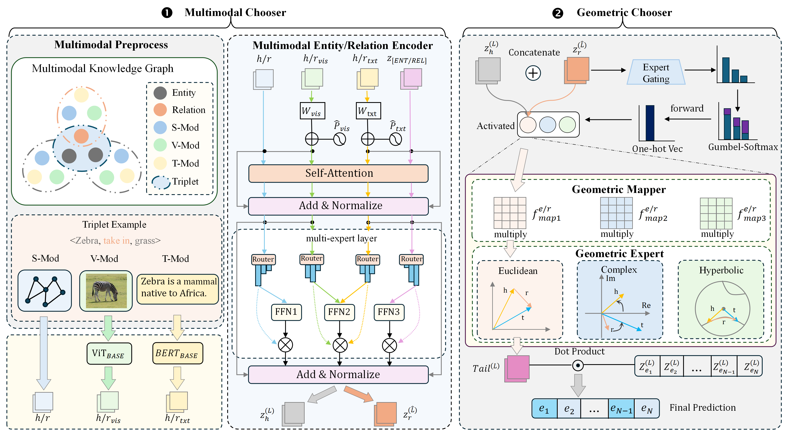

# Readme
<h1 align="center">
  ChoicE
</h1>
<h4 align="center">Make Your Choice for Multimodal Knowledge Graph Completion</h4>

<h2 align="center">
  Overview of ChoicE
  
</h2>

This paper has been submitted to the Knowledge-Based Systems.

🚧 Upcoming work: We are building our next project on top of this code. Stay tuned — code will be released soon.
